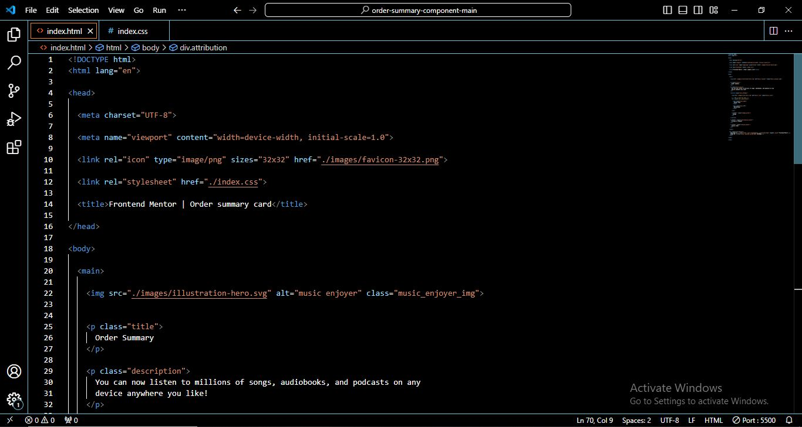
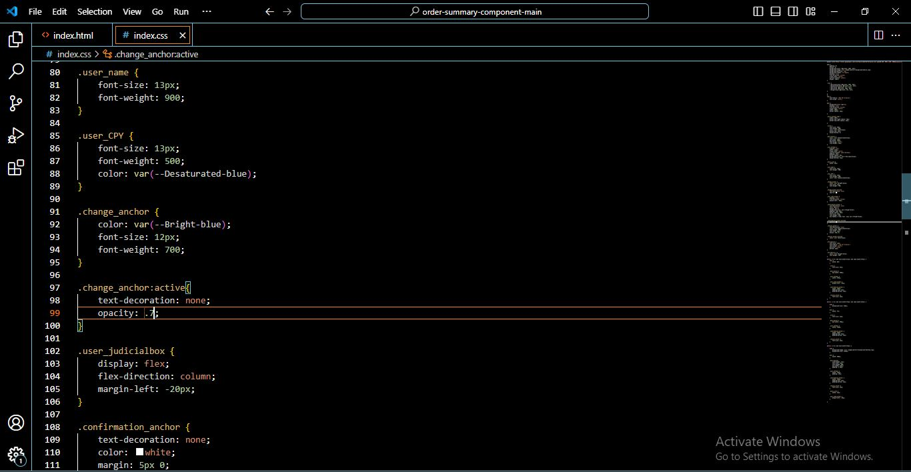
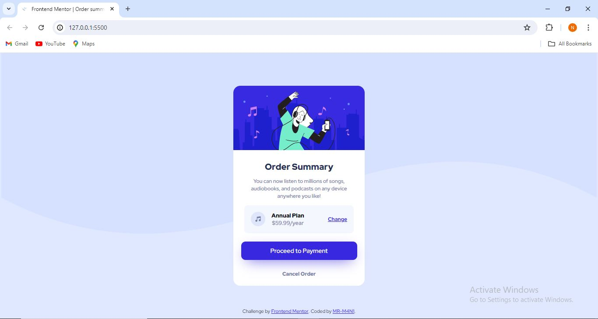

## Table of contents

- [Overview](#overview)
  - [Screenshot](#screenshot)
  - [Links](#links)
  - [Built with](#built-with)
  - [What I learned](#what-i-learned)
  - [Continued development](#continued-development)
  - [Useful resources](#useful-resources)
- [Author](#author)
- [Acknowledgments](#acknowledgments)

## Overview

### Screenshot

### Links

- Solution URL: [GIT_URL](https://github.com/MR-M4N1/Order_summary_card)
- Live Site URL: [GIT_LIV]()

### Built with

- Semantic HTML5 markup
- CSS custom properties
- Flexbox
- Mobile-first workflow

### What I learned

--------------------------------------------

### Continued development

--------------------------------------------
### Useful resources

--------------------------------------------
## Author

- Frontend Mentor - [@MR-M4N1](https://www.frontendmentor.io/home)

## Acknowledgments

-------------------------------------------
